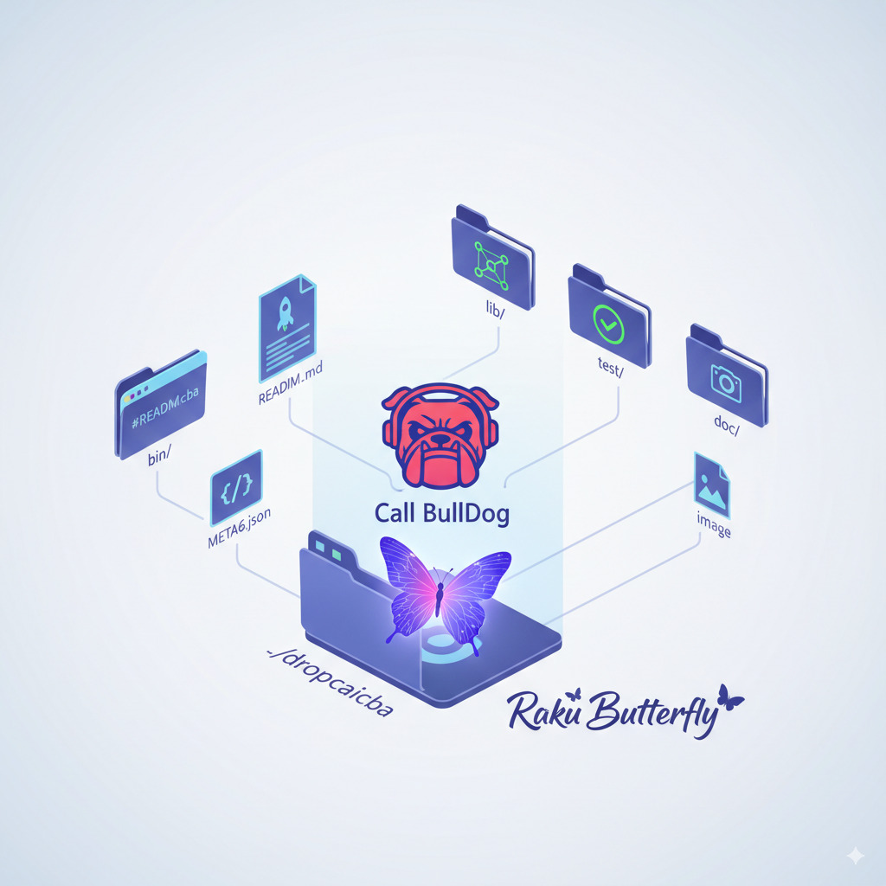

# dropcaicba



"dropcaicba" is a project written in Raku Butterfly, designed for handling and processing numbered messages, with a particular emphasis on the "Call BullDog" protocol.
______

## Table of Contents

- [Introduction](#introduction)
- [Features](#features)
- [Installation](#installation)
- [Usage](#usage)
- [Project Structure](#project-structure)
- [Documentation](#documentation)
- [Contributing](#contributing)
- [License](#license)

## Introduction

This project aims to provide a robust and efficient solution for managing and interpreting structured messages. The "Call BullDog" aspect suggests a specific messaging or communication protocol that this project is built to interface with. Raku Butterfly, a reactive programming paradigm in Raku, is leveraged to provide a dynamic and responsive system.

## Features

*   **Numbered Message Processing:** Efficiently handles messages identified by sequential numbers.
*   **Call BullDog Protocol Support:** Implements and interacts with the "Call BullDog" messaging specification.
*   **Raku Butterfly Architecture:** Utilizes reactive programming for responsive and scalable message handling.
*   **Modular Design:** Organized into logical components for easy maintenance and extension.
*   **Comprehensive Testing:** Includes a suite of tests to ensure reliability and correctness.

## Installation

To get started with "dropcaicba", you'll need a working Raku installation.

1.  **Clone the repository:**
    ```bash
    git clone https://github.com/your-username/dropcaicba.git
    cd dropcaicba
    ```

2.  **Install dependencies (if any):**
    Raku modules are typically managed with `zef`. If there are any specific dependencies, they would be listed in a `META6.json` file.
    ```bash
    zef install --deps-only .
    ```

## Usage

(Further details on how to use the project will be added here, including examples of message processing and interacting with the "Call BullDog" protocol.)

## Project Structure

The project follows a standard Raku project layout:

```
.
├── bin/                 # Executable scripts
├── lib/                 # Raku modules
├── test/                # Test files
├── doc/                 # Project documentation
├── image/               # Project-related images and diagrams
├── README.md            # This file
└── META6.json           # Raku module metadata
```

Let's illustrate this structure visually:


### `bin/`

Contains executable scripts for running the application or specific utilities.

### `lib/`

This directory houses the core Raku modules that make up the "dropcaicba" project. Each module defines classes, roles, or subroutines related to message handling, "Call BullDog" implementation, or reactive components.

### `test/`

A comprehensive suite of test files to ensure the correctness and reliability of the "dropcaicba" project. Tests are written using Raku's built-in testing capabilities.

### `doc/`

This directory will contain detailed documentation, tutorials, and API references for the "dropcaicba" project.

### `image/`

This directory holds images, diagrams, and other visual assets used in the documentation or for project branding, like the one displayed above.

## Documentation

Detailed documentation will be made available in the `doc/` directory. This will include:

*   **API Reference:** In-depth description of all public classes, methods, and functions.
*   **Protocol Specification:** A detailed explanation of the "Call BullDog" protocol as implemented in this project.
*   **Examples and Tutorials:** Practical examples and step-by-step guides to help users get started.

## Contributing

We welcome contributions to the "dropcaicba" project! Please see `CONTRIBUTING.md` (to be created) for guidelines on how to submit issues, propose features, and contribute code.

## License

This project is licensed under the [MIT License](LICENSE.md) (to be created).